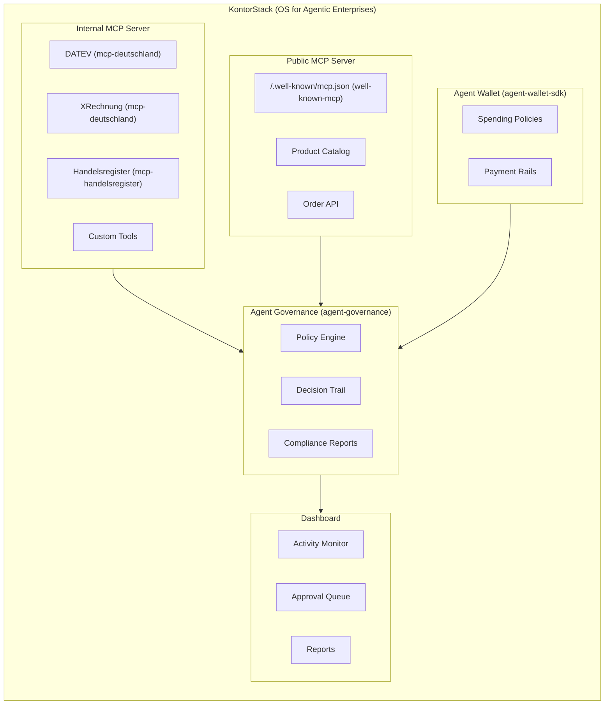

# KontorStack

<div align="center">
  
  
  
</div>


> Das Betriebssystem für agentische Unternehmen.

Vom hanseatischen Kontor zur KI-Autonomie: Ein Framework, das jedes Unternehmen in 30 Minuten agentisch macht. KontorStack bündelt alle Kernkomponenten des Agentic Commerce Stack zu einer nahtlosen, out-of-the-box funktionsfähigen Plattform.

`npx create-kontorstack` — Interner MCP. Öffentlicher MCP. Governance. Payments. Fertig.

## Die Vision: Warum jedes Unternehmen einen Agentic Stack braucht

Wir befinden uns im Übergang von Software, die _von_ Menschen bedient wird, zu Software, die _mit_ Software verhandelt. Das klassische ERP-System ist nicht für Agenten gebaut. Unternehmen benötigen eine grundlegend neue Infrastruktur, um sicher und automatisiert am Agentic Commerce teilzunehmen. 

KontorStack (angelehnt an das hanseatische Kontor) ist dieses Fundament: Es kombiniert traditionelle deutsche Geschäftssicherheit (DATEV, ELSTER, XRechnung) mit modernster KI-Agenten-Autonomie. Es hebt Unternehmen auf das nächste Level im [Agentic Maturity Model](https://github.com/matteo-ise/agentic-maturity-model).

## Architektur

KontorStack vereint 7 spezialisierte Frameworks in einer kohärenten Architektur:



## Quick Start (30 Minuten zur Autonomie)

Starte dein agentisches Setup mit unserem CLI-Tool:

```bash
npx create-kontorstack
```

Der Assistent führt dich durch alle notwendigen Schritte:
1. Unternehmensdaten eingeben
2. Integrationen auswählen (z.B. DATEV, XRechnung)
3. Payment-Provider festlegen
4. Governance-Level bestimmen

Danach kannst du dein Projekt direkt starten:
```bash
cd mein-kontorstack
npm install
npm run dev
```

## Template Vergleich

| Feature | Startup (1-50) | Mittelstand (50-500) | Enterprise (500+) |
|---------|----------------|----------------------|-------------------|
| **Governance** | Standard | Standard + Financial Controls | Strict (ISO27001, DSGVO) |
| **Integrationen** | Slack, GitHub | DATEV, XRechnung | DATEV, SAP, Custom |
| **Public MCP** | Status API | Catalog, Order API | Full Suite + Rate Limiting |
| **Payments** | Growth | Conservative | Strict Audit |

## Roadmap

- [x] CLI Scaffolding (`create-kontorstack`)
- [x] Zentrale Konfiguration (`@kontorstack/core`)
- [ ] Next.js Dashboard Vollintegration
- [ ] Erweiterte Templates für Industrie & Handel
- [ ] One-Click Deployment für AWS/GCP


## 🚀 Quantum Leap Architecture: K8s Operator & Service Mesh

Ein `npx create` Skript reicht nicht für den Konzernbetrieb. KontorStack ist Cloud-Native:
- **Kubernetes Operator:** Spinnt das gesamte Agenten-Ökosystem via `kubectl apply` hoch.
- **Envoy Proxy Sidecars:** mTLS, Rate-Limiting und JSON-RPC Routing *out of the box*.
- **OpenTelemetry:** Distributed Tracing für jeden Token und Tool-Call direkt in Jaeger/Grafana.


---

**Teil des Agentic Commerce Stack von Matteo Ise:**

- [well-known-mcp](https://github.com/matteo-ise/well-known-mcp) — Discovery-Standard für KI-Agenten
- [agent-wallet-sdk](https://github.com/matteo-ise/agent-wallet-sdk) — Unified Payment Infrastructure für Agenten
- [agent-governance](https://github.com/matteo-ise/agent-governance) — Audit, Compliance & Human-Escalation
- [mcp-deutschland](https://github.com/matteo-ise/mcp-deutschland) — MCP-Server für ELSTER, DATEV, XRechnung
- [mcp-handelsregister](https://github.com/matteo-ise/mcp-handelsregister) — Deutsches Handelsregister für Agenten
- [agentic-commerce-sdk](https://github.com/matteo-ise/agentic-commerce-sdk) — Agent-to-Agent Commerce
- [agentic-maturity-model](https://github.com/matteo-ise/agentic-maturity-model) — Reifegrad-Framework (Stufe 0→5)
- [kontorstack](https://github.com/matteo-ise/kontorstack) — Full-Stack Framework für agentische Unternehmen

[Matteo Ise auf GitHub](https://github.com/matteo-ise) · [X/Twitter](https://x.com/matteoise)
